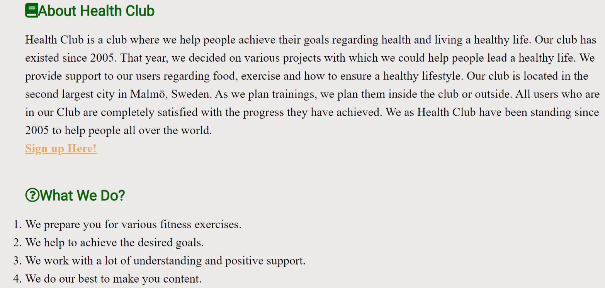
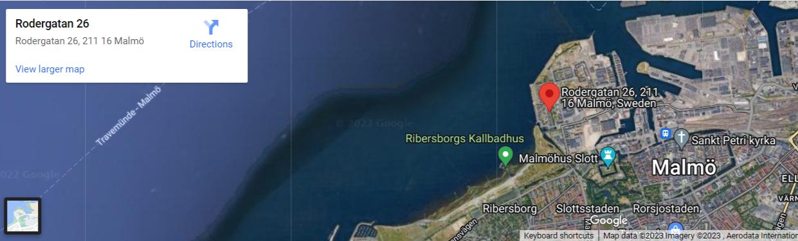
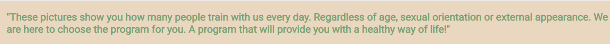
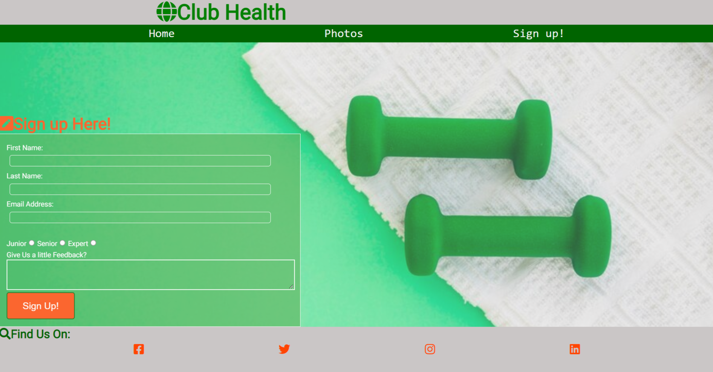

# Club Health
Club Health is a website that allows the user to find interesting information about us as a club where we introduce people to our work. It can give the user the necessary information to join the club where he will improve his healthy lifestyle. 

## Features
* Navigation
  * Featured at the top of the page, the navigation shows the club name in the middle of the top corner.
  * The navigation links are in the middle under the name Club Health.
  * The navigation font style is Lato and the color is white with the background green color.
  * The navigations links are : Home, Photos and Sign Up!
  * All the navigation links referal to diffrent sections of informations.
  
* The Header Section
  * The header background is in nice eye fit color light grey.
  * The Logo picture respresent the page logo with healthy view on healthy lifestyle.
  * The picture cointain also a logo name of The Health Club what is telling the user that he is Welcome to join our club.
  
* The About Health Club section
  * The About Health club section gives the user information when and where The Club Health started.
  * The About Us section gives the user usefull and trust wordhy informations about how we are working.
  * Under the text of the About health Club section, we have a link that leads directly to the application, Sign up!
  * In this section we also telling the user What We Do as Health Club.
  
* Here We Are Section
    * This section provides information to the user to find us more easily through the live location and by the way enables the user to visually see the exact written address on the "Read more" option.
    * The section is written in warm green color and gives the user the opportunity to choose the path to the Health Club location.
    
    
* The Footer Find Us on
  * The footer section includes links to the social media sites for Health Club. The links will open in new tab and allow easy navigation for the user.
  * The footer is useful to the user and provides to him a good connection to social media.
  * The social media links are in color orangered what is fitting on nice color green letters and light grey background.
  

## Photos
  * The pictures will give the user an insight into the various activities that our team offers.
  * The pictures present great activity in training and a healthy lifestyle.
  

* Text Under the Photos
  * The text below the pictures is a small explanation of what the pictures mean and what they represent.
  

## Sign Up! Section
 * The section serves the user to log in to the Health Club page, which will enable him to provide treatment services.
 * The Sing Up section contains fields for user's name, surname, email address, in which condition the user is, feedback and the  Sing Up button.
 

 ## Technologies
 * HTML
   * The structure of the Website was developed using HTML as the main language
 * CSS
   * The Website was styled using custom CSS in an external file.
 * Font Awesome 
   * Icons used for obtain titles nad Social media links in footer section.
 * Pixels
   * Pictures are taken from this website.

## Validator Testing
 * HTML
   * No errors were returned when passing through the official W3C validator[ HTML Validator ](https://validator.w3.org/nu/#textarea)
 * CSS
   * No errors were found when passing through the official [CSS Validator](https://jigsaw.w3.org/css-validator/validator)

## Unfixed Bugs
 * One picture in the Gallery, the third picture in the row of pictures, jumps out of the row. I tried but it didn't work. And the screen slightly jumps out of size on the right side. You can see the scroll bar at the bottom of the page. Maybe it's because there is too much width in the sections. Tried to solve the same but it was not successful. The reason is the lack of advice and instruction.

## Deployment
* The site was deployed to GitHub pages. The steps to deploy are as follows:
  * In the GitHub repository, navigate to the Settings tab.
  * From the source section drop-down menu, select the Main Branch
  * Once the main branch has been selected, the page will be automatically refreshed with a detailed ribbon display to indicate the successful deployment.

##