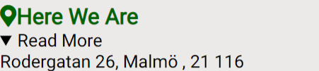

# Club Health
Club Health is a website that allows the user to find interesting information about us as a club where we introduce people to our work. It can give the user the necessary information to join the club where he will improve his healthy lifestyle. 

## Features
* Navigation
  * Featured at the top of the page, the navigation shows the club name in the middle of the top corner.
  * The navigation links are in the middle under the name Club Health.
  * The navigation font style is Lato and the color is white with the background green color.
  * The navigations links are : Home, Photos and Sign Up!
  * All the navigation links referal to diffrent sections of informations.
  
* The Header Section
  * The header background is in nice eye fit color light grey.
  * The Logo picture respresent the page logo with healthy view on healthy lifestyle.
  * The picture cointain also a logo name of The Health Club what is telling the user that he is Welcome to join our club.
  
* The About Health Club section
  * The About Health club section gives the user information when and where The Club Health started.
  * The About Us section gives the user usefull and trust wordhy informations about how we are working.
  * Under the text of the About health Club section, we have a link that leads directly to the application, Sign up!
  * In this section we also telling the user What We Do as Health Club.
  
* Here We Are Section
    * This section provides information to the user to find us more easily through the live location and by the way enables the user to visually see the exact written address on the "Read more" option.
    * The section is written in warm green color and gives the user the opportunity to choose the path to the Health Club location.
    
    